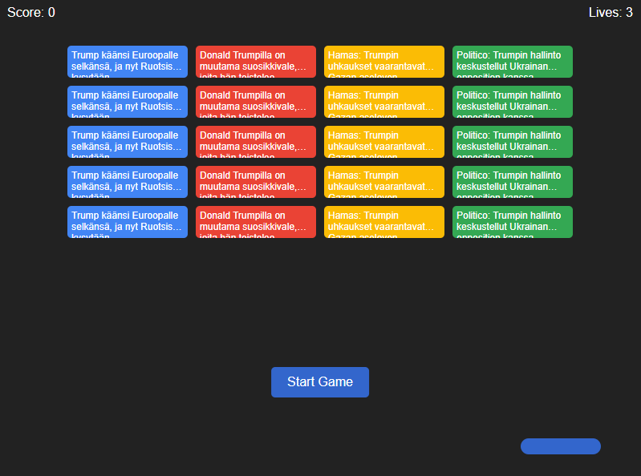

# Trump News Breakout Game
[](https://github.com/ristoxxx/trumpDjango/actions/workflows/dailyapicall.yml)
 
A web-based Atari Breakout clone that turns news headlines into breakable blocks, inspired by Google's Breakout easter egg.
Hosted at [Railway](https://trumpdjango-production.up.railway.app/game)  
[](mailto:lahteri@gmail.com)
<p align="center">
<br>
<strong>Game sreenshot</strong>
</p>

## Overview

This project combines the classic Atari Breakout game with real-time news data from a Trump-related news API. Each news headline becomes a breakable block in the game, and clicking on a block opens the corresponding news article.

## Features

- **Real-time News Integration**: Fetches headlines from a news API and turns them into breakable blocks
- **Interactive Gameplay**: Classic Breakout mechanics with paddle and ball
- **Clickable Headlines**: Each block functions as a link to the full news article
- **Google Easter Egg Style**: Visual design inspired by Google's Breakout easter egg with their signature colors
- **Responsive Design**: Works on both desktop and mobile devices
- **Score Tracking**: Keep track of your progress as you break news blocks

## How It Works

### Data Flow

1. The game fetches news from the API endpoint: `https://trumpdjango-production.up.railway.app/read/`
2. News headlines are processed and converted into game blocks
3. The most recent headlines appear first in the game (reverse chronological order)
4. If there aren't enough articles, existing ones are repeated to fill the game board

### Game Mechanics

- **Controls**: Move the paddle with your mouse or touch (on mobile)
- **Scoring**: Earn 10 points for each block you break
- **Lives**: You start with 3 lives, losing one each time the ball falls below the paddle
- **Victory**: Break all blocks to win and receive a 100-point bonus

### Technical Implementation

The game is built using vanilla JavaScript, HTML, and CSS, with no external dependencies.

#### Key Components:

- **Ball Physics**: The ball bounces realistically off walls, blocks, and the paddle
- **Collision Detection**: Precise collision checking between the ball and game elements
- **Responsive Paddle**: The paddle follows mouse or touch movement
- **Block Grid System**: Dynamic grid layout that adjusts based on screen size

## API Integration

The game connects to a Django backend API that provides Trump-related news in JSON format:

```json
[
  {
    "title": "Politico: Trumpin hallinto keskustellut Ukrainan opposition kanssa vallanvaihdosta",
    "link": "https://yle.fi/a/74-20010573?origin=rss"
  },
  {
    "title": "Hamas: Trumpin uhkaukset vaarantavat Gazan aselevon",
    "link": "https://yle.fi/a/74-20147821?origin=rss"
  }
]
```

Each headline is displayed on a block with a link to the full article.

## Code Structure

### Core Functions

- `fetchNews()`: Retrieves news data from the API endpoint
- `createBlocks()`: Generates the game blocks from news data
- `startGame()`: Initializes gameplay and creates the ball
- `gameLoop()`: Manages game physics and interaction
- `updateBallPosition()`: Handles ball movement
- `endGame()`: Manages game completion logic

### Event Handling

- Mouse/touch movement for paddle control
- Click events on blocks to open news articles
- Start/restart game buttons

## Setup and Deployment

### Local Development

1. Clone the repository
2. Open `index.html` in a web browser
3. No build process required - it's pure HTML, CSS, and JavaScript

### Deployment

The game can be deployed to any web server or static site hosting service:

1. Upload all files to your web server
2. No server-side processing is required as all API calls are made client-side

## Future Enhancements

Potential improvements for future versions:

- Multiple levels with increasing difficulty
- Power-ups (e.g., multi-ball, expanded paddle)
- Sound effects and background music
- User high score leaderboard
- Different visual themes

## License

MIT License

## Credits

- News data provided by Trump News API
- Game concept inspired by Atari Breakout and Google's Easter Egg


